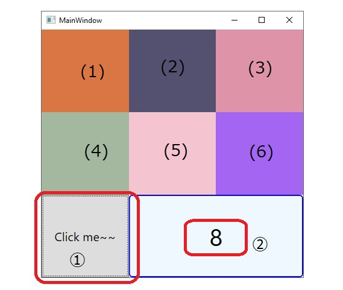
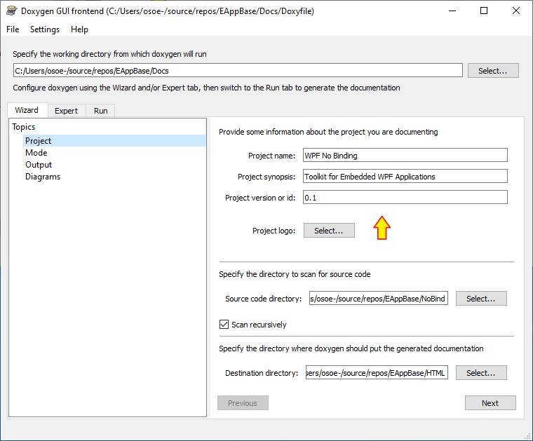
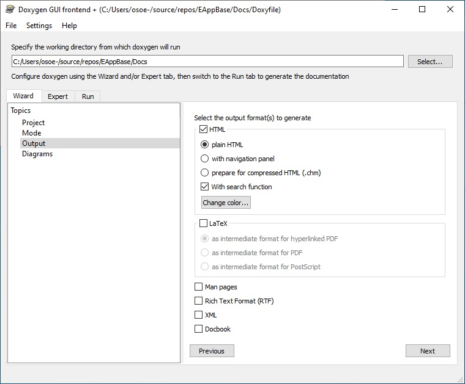
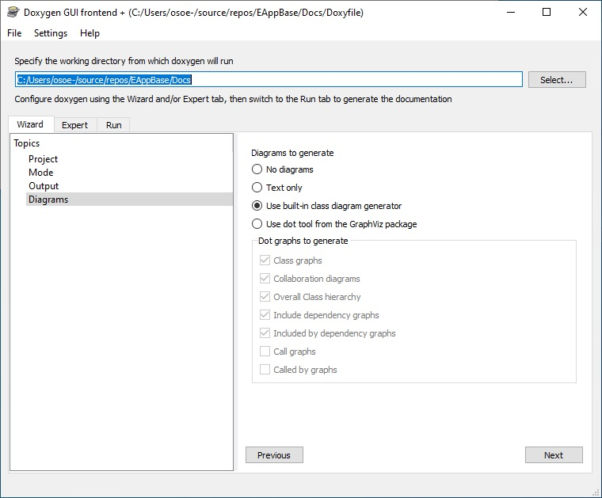
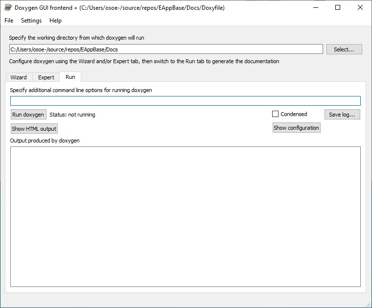
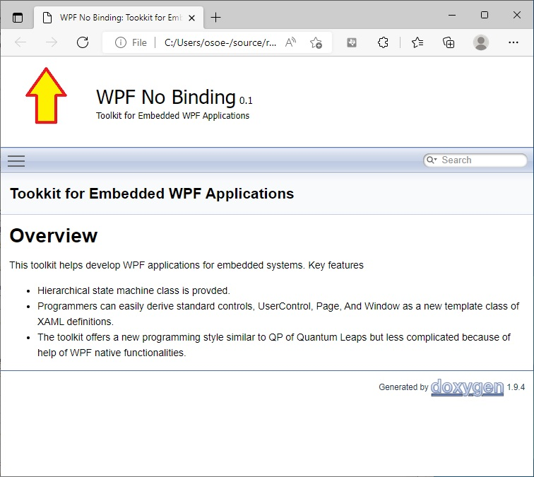

@page DoxygenをWPFプロジェクトに適用して読みやすい設計文書を作成する
# Doxygen をWPFプロジェクトに適用して読みやすい設計文書を作成する
Note: This document is writtten only for Japanese.<br>
Note: この文書は日本人向けに書かれています。<br>
Note: [Doxygen official site](http://www.doxygen.jp/)はここ。

## 0. Overview
Doxygenを使うとソフトウェアの設計文書をそこそこの読みやすさで手っ取り早く作成することができます。
Doxygen初心者(筆者も初心者ですが)向けに基本的な使い方を説明します。ここで説明することは以下の項目です。
1. 画像ファイルを含むMarkdown文書の取り込み
2. Markdown文書作成時の注意
3. WPFプロジェクト作成時の注意
4. Doxywizard操作手順

## 1. 画像ファイルを含むMarkdown文書の取り込み
.mdファイルには以下のような方法で種々のフォーマットの画像ファイルを取り込むことができます。
```

```
* 代替テキスト: renderingできないときにこのテキストが表示される
* file-path : 相対でも絶対でもOKです。相対の場合は当該.mdファイルを起点とする相対パスになります。
Doxygenは.mdを.htmlに変換するときに上記のfile-pathをそのままコピーします。.mdファイルに対応する
.htmlファイルは以下のようになります。
```
<filename-base>.md
md_<filename-base>.html
```
ただし`<filename-base>`中の大文字は'C'は'_c'に変換されます。<br><br>
.mdファイル中の画像ファイル参照部
```

```
は.htmlファイルでは以下のように表現されています。
```

```
相対パスがそのままコピーされていることがわかります。この.htmlファイルはDoxywizard(後述)で
指定する`HTML出力パス/html/`直下に置かれます。したがって.mdファイルが参照しているディレクトリの
シンボリックリンクをhtmlディレクトリ下に作ることで.htmlファイルからも参照できるようになります。
これはcmd.exeを使って以下のように行います。
```
cd <HTML出力ディレクトリ>
mklink /D <md参照image-directory> <html参照image-directory>
```
サンプルプロジェクトではディレクトリツリーは以下のようになります。<br><br>
.md参照ディレクトリツリー
```
EAppBase/Docs/
  |
  +-- Appy-Doxygen-JP.md
  +-- GUI-Top.md
  +-- GUI-Interface.md
  +-- REDME-Main.md
  +-- Figuures/
        |
        +-- Up-Arrow.png : ロゴマークに使う
        +-- GUI-Top.jpg : GUI-Top.mdから参照される
```
<br>.html参照ディレクトリツリー
```
EAppBase/HTML/html/
  |
  ... : たくさんあるのでこの文書の説明に不要なものは省略
  |
  +-- md__g_u_i__interface.html
  +-- md__g_u_i__top.html
  +-- Figures/ : 先に説明したmklinkの手順で作ったシンボリックリンク
        |
        +-- Up-Arrow.png : ロゴマークに使う
        +-- GUI-Top.jpg : GUI-Top.mdから参照される
```

## 2. Markdown文書作成時の注意
[この記事](https://embeddedinventor.com/guide-to-configure-doxygen-to-document-c-source-code-for-beginners/https://embeddedinventor.com/guide-to-configure-doxygen-to-document-c-source-code-for-beginners/)
に
[.mdでDoxygen文書のページを作る](https://embeddedinventor.com/guide-to-configure-doxygen-to-document-c-source-code-for-beginners/#Doxygen_pages)
簡単な手順が書かれています。

## 3. WPFプロジェクト作成時の注意
* C#プロジェクトのプロパティを開くと左ペインに`Build`という項目があります。これを選択すると下のほうに`XML documentation file:`という項目があります。これをチェックします。筆者はパスをデフォルトのまま使いました。
* XML Documentation Comment生成機能有効時には`public`になっているものにDocumentation Commentが書かれていないとコンパイル時に警告が出ます。
警告がなくなるまでコメントを追加することで書き漏れを防ぐことができます。小さい`interface`が他の定義と同じファイルにおかれているときなどに書き漏れが生じやすいので便利な機能です。

## 4. Doxywizard操作手順
### Wizard
DoxygenをデフォルトでインストールするとWindowsのスタートメニューにDoxywizardのアイコンができます。
これをクリックするとDoxywizardがスタートします。
左ペインに`Wizard`, `Expert`, `Run`のタブがあります。
操作は`Wizard` → `Expert` → `Run` の順になります。
`Wizard`タブでは自分で書いたMarkdown文書を追加することができません。ごく基本的な設定をまずここで行います。
過去に使った類似のDoxyfileがあるときはそれをもとに開始します。Doxyfileは &nbsp; file &gt;&gt; Open...　で開きます。最初に`Wizard-Project`
<br>  <br>が選択されます。ここでディレクトリパスなどプロジェクト固有の必要項目を設定します。
右ペイン右下の`Next`で一般的な作業順序の通りに進めていけます。`Next`をクリックで `Wizard-Mode` へ移動します。これはデフォルトのまま次の`Wizard-Output`
<br><br>へ移動します。ソフトウェア開発プロジェクトの設計文書としてはHTMLだけで十分です。印刷物を
作成するときはLaTeX, Docbook等を選択します(筆者はこの辺は未経験)。デフォルトではHTMLとLaTeXが選択されているのでLaTeXはチェックを削除します。
次に`Wizard-Diagram`
<br> <br>へ移動します。
オブジェクト間の関係図、クラス継承図などの作成に使うグラフィクスエンジンを選択します。Graphvizがインストールされているとこちらを使えるようですが試していません。

### Expert
ひと通り基本設定が出来たら次は`Expert`タブでMarkdownをインポートする設定を行います。
`Expert`で設定するのは`Expert-Input`<br><br>だけです。赤字になっている箇所は設定を追加した箇所です。
* `INPUT` : C#ソースディレクトリとMarkdownのディレクトリを設定します。
* `RECURSIVE` : 上記で設定したディレクトリのサブディレクトリも使いたいときはチェックします。
<br>

右ペインをスクロールして最下段まで進むとHTML文書の表紙に使われるMarkdownファイル
の選択項目があります。
<br>.jpg)<br>


### Run
ここまでの手順でDoxyfileの設定が終わりました。再利用のため設定を保存することができます。
File &gt;&gt; Save as ...　で保存できます。  
最後に`Run`
<br><br>
ペインに移動します。ここで`Run doxygen`を選択すれば.html文書が作成されます。
作成された文書を`Show HTML output`で確認できます。このサンプルでは以下のようになりました。
<br><br>
少し面倒ですが閲覧しやすい設計文書を作成できました。WordやExcelで作ろうと思ったらうんざりしますね。
Doxygenは.RTFを出力できるので.RTFを経由してWordに取り込んでみましたが間延びした文書になって見やすいものにはなりませんでした。
WordのナビゲーションにHTMLリンクが渡されることもありません。


## 5. 感想
Doxygenの生成文書は少し気を使って作成すると十分業務の助けになる設計文書を生成できます。
日本企業の中でも積極的に活用していただきたいと思います。ただしそれにより工数削減、品質向上、
社内の業務環境向上などを達成できた時はその何パーセントかをプロジェクトに寄付していただければ
うれしいです。