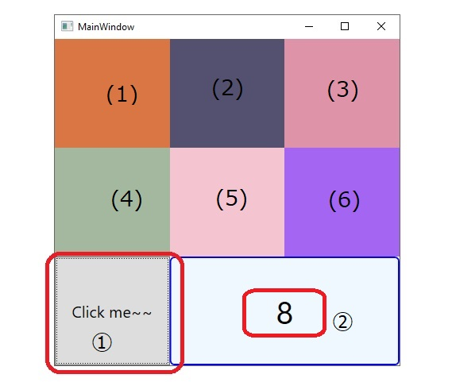

@page GUI Operation
# Appearance
  
Figure 1. GUI top window image  

* ➀ : action button invoking all actions in the window.
* ➁ : an text label showing a number kept in MainWindow.Counter.
* (1) through (6) : Solid color panes which are filled with random colors.
* Each button click operation refills one of the six color panes. The refilled
pane is selected by (MainWindow.Counter % 6).